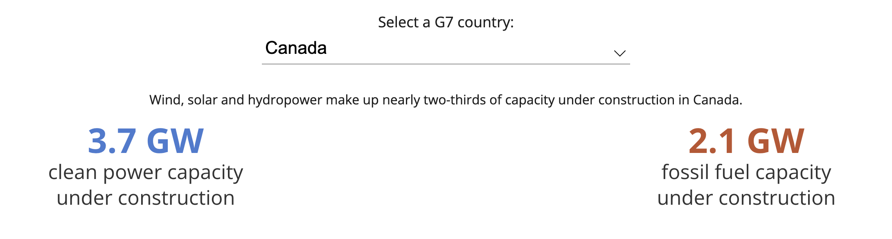
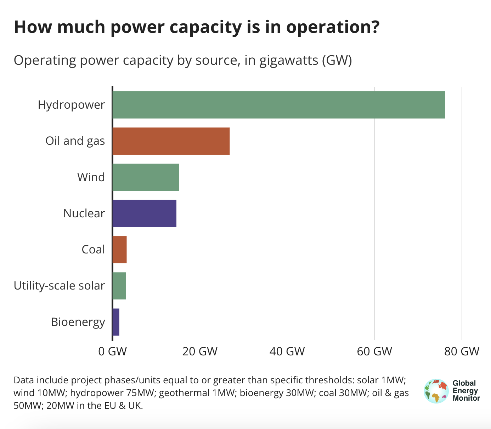
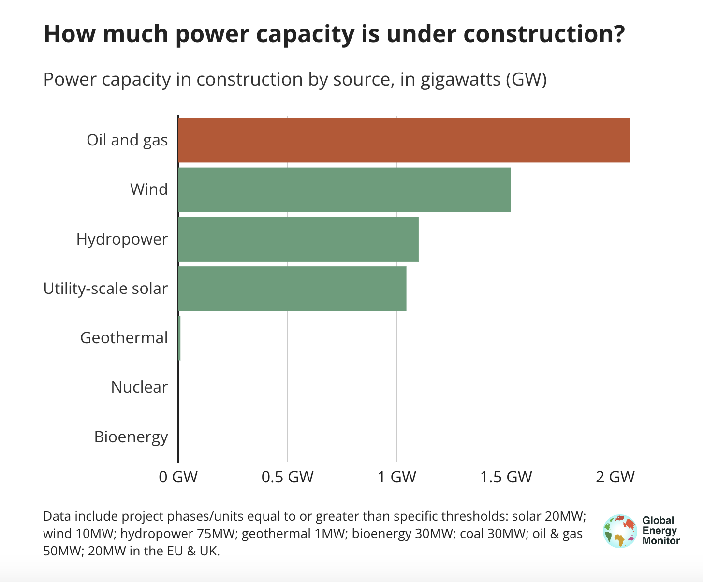
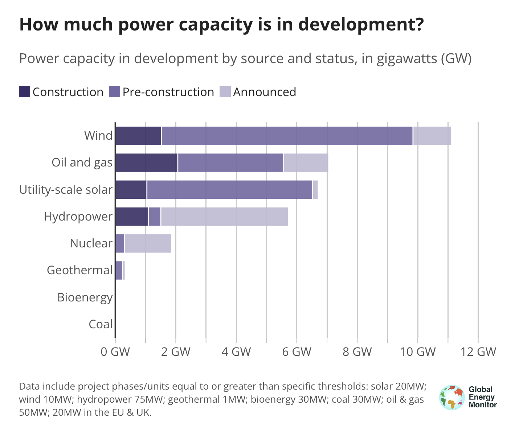
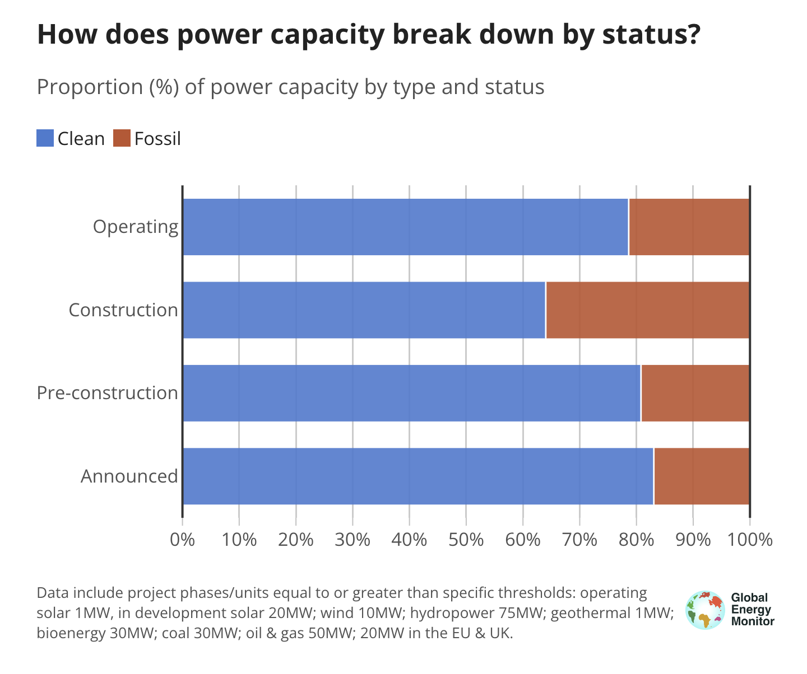

# Global Integrated Power Tracker dashboard

This repository hosts the code for the [Global Integrated Power Tracker dashboard](https://gipt-dashboard-b8f457be7fe8.herokuapp.com/), built using the [Flourish API dashboard template setup](https://github.com/GlobalEnergyMonitor/Flourish-API-dashboard-template). For the full instructions on how the Flourish API framework, you can go through the comprehensive README that includes all the different steps on how to set and configure a new dashboard in the template Github repo. This repo will focus on how to update and make changes to the Global Integrated Power tracker dashboard, which has not yet launched (as of October 2024) and is in draft mode, including only the G7 countries as a test version.  

This README itself is split up into four different sections. The first section explains how each of the dashboard components are set up, with a snapshot of the data structure that make up each of the elements. Then there is a short guide to updating the dashboard. The third section provides detail on how each of the different elements making the dashboard up are structured and created, while the last section provides a more detailed step-by-step guide to updating the dashboard. 

## How the GIPT dashboard is set up

The dashboard has been created using the Flourish API template, and is made up of:  
- a text summary, the summary phrase that provides a key fact about the country/region selected
- a "data ticker": the three large numbers and text that animates for every country/region selected
- four separate Flourish data visualisations  

It therefore has six different elements, each with its own data file and structure. Below we will go through the key details for each one, including the data structure each of these elements needs - however it is worth a very brief introduction into how the dashboard set up works and is updated, with the full details in the [Flourish API dashboard template setup README](https://github.com/GlobalEnergyMonitor/Flourish-API-dashboard-template). 

### Overview / How it works
There are a number of config files which control what the dashboard is showing. These can be found in `public/assets/`:
* `page-config` describes what is in the whole page. Here you can specify the graphs in the page and the order they show, the tickers, the filtering type.
* `chart-config` contains the details for each chart - there are a number of config options needed, including a reference to the dataset and which keys in the data are being used where in the chart. There are optional additional config opotions, such as if the chart responds to filtering
* `text-config` this contains the text that appears outside the flourish graphics in the page - the title, any summaries etc.

**Things to note:**
* Datasets for each graphic are expected to live in `public/assets/data`
* The main page building blocks are `index.js`, `index.html` and `index.css`. A server can be found in `server.js` to handle the API requests to Flourish.
* The order of the countries in the dropdown is determined in the order the countries appear in the `text-config` data array. 
* Each of the dataviz except the data tickers has to be created and set up in Flourish, but the title and subtitle, as well as the actual data used in the version that shows up in the dashboard comes from the `chart-config.json` file and the relevant data files in this repo. 
* For your charts to work, the data header names in your data need to match with the names you assign to the variables in the `chart-config.json`. 
* In order for a chart to show up for a specific selection, the json file with data for that chart needs to include data for that chart, even if the totals are 0. If a country is not included in the data, when you select that country in the dropdown the chart will appear greyed out - so best to include data with 0s for each entry. 

## Update the dashboard: Quick guide

To make changes to the dashboard, you need to:
* change the data json files
* amend the relevant info in the config files (chart titles and subtitles or new filenames for your data if you are changing them)  
* change the summary text in the `text-config.json` file - the order the countries appear in this file sets the order the countries appear in the dropdown
* make any text changes in other relevant config files (page title, dropdown text, footnote)  

*If adding a new datapoint, (eg a new year's data), you may also need to make some minor changes to the original Flourish links (such as changing the axis labels for example).*

**Datasets**
Any new data should be pushed to `public/assets/data` and be in `json` format. Each json file in the data folder is used in each of the elements that make up the page (data ticker numbers at the top and the four charts). 
* `gipt_operating_g7_v1.json`  
* `gipt_construction_g7_v1.json`    
* `gipt_development_g7_v1.json`  
* `gipt_type_status_g7_v1.json`
* `gipt_data_ticker_g7_v1.json` 

If changing the filename of the data file, as you will probably want to do once moving to a final version from the test version with just G7 countries, you will need to amend the value of the `dataset` variable in the `chart-config.json` document. If you make any changes to your data column names, you will need to change the relevant values in the chart config file, but if you replicate the existing structure, this should not cause any issues. 

**Summary text**
To update the summary text, you must do so in the `text-config.json` file. The order the countries appear here are the order they appear in the dropdown. Remember, a country must be included here to show up in the dropdown. Even if it is included in all the data files, if it is not listed in the text config file, it will not show up. 

**Other text**
All other text that is included in the page comes from either the text-config page (footnote and dropdown text for example) and the title comes from the index.html page. The chart title and subtitle text are defined in the `chart-config.json`, not the Flourish page. 

**Flourish changes**
For any updates or changes to the visualizations beyond the data, title and subtitle, the changes should be made in the Flourish links for each of the graphics. So if you want to change the footnote, the suffix, the colours or any other tweaks to the charts themselves beyond the datak, title and subtitle, you need to do so in the Flourish links

**Data download links**
You can add a data download link at the bottom left of each chart, like in the [GCPT](https://globalenergymonitor.org/projects/global-coal-plant-tracker/dashboard/) and [GOGPT](https://globalenergymonitor.org/projects/global-oil-gas-plant-tracker/dashboard/) dashboards. If you do add the download links to each Flourish chart, these files are updated manually - the new data first needs to be uploaded to the GEM Wordpress media library so that a link can be generated for them, and then that link should be updated in the `Footer` section of the respective Flourish link. 

**Putting your changes live**

Pushing your changes to the main branch on Github should trigger an automatic rebuild on Heroku and your changes should be reflected on the published dashboard almost instantly.

Below, you will find more detail about each element of the dashboard, the data structure for each and the full process into updating it with each release, including how to generate the datasets.   

## GIPT dashboard detail

### Element 1: Summary text


The summary text is optional for a dashboard, as well as it being possible to include summary text for some selections and not have any for others. Currently, this is how the GIPT test version is set up, with summary text for every country, but this can be amended as this moves into the live version. 

There is no Flourish ID or Flourish visualisation associated with the summary text, it is all included and set up in the `public/assets/text-config.json` file. 

Important to note however that even if you do not have any summary text, the text-config file needs to include the name of each of the dropdown/filter selections - while the **order they are in your text-config file will be the order of your dropdown**. 

**Data structure:**

``` 
[
    {
      "Country": "Canada",
      "overall_summary": "Wind, solar and hydropower make up nearly two-thirds of capacity under construction in Canada."
    },
    {
      "Country": "France",
      "overall_summary": "France has no fossil-fuelled power projects in development."
    },
    {
      "Country": "Germany",
      "overall_summary": "Around three-quarters of capacity under construction in Germany is wind and solar."
    },
    {
      "Country": "Italy",
      "overall_summary": "Oil and gas plants constitute the largest source of capacity under construction in Italy."
    },
    {
      "Country": "Japan",
      "overall_summary": "Oil and gas plants constitute the largest source of capacity under construction in Japan."
    },
    {
      "Country": "United States",
      "overall_summary": "The United States has more than **five times** as much clean power in construction than fossil fuel capacity."
    },
    {
      "Country": "United Kingdom",
      "overall_summary": "The UK has 14 GW of clean energy under construction, with two-thirds of it wind power."
    },
    ....
]
```

### Element 2: Data ticker  

  

Data tickers are also optional for a dashboard, as well as it being possible to choose the number of data points you want to display. Currently, the GIPT draft dashboard is set up with two key data points, which are:
- Clean capacity under construction 
- Fossil fuel capacity under construction

The attributes for the tickers are customisable and can be set within the `page-config` file and the colours set in the config file are fallbacks in this case. The colours for each of the text selections can also set within the `public/assets/data/gipt_data_ticker.json` file, you can see how the other GCPT and GOGPT dashboard code and json files are structured on how to do that.


**Data structure:**
```
[
 
    "Country": "Canada",
    "summary_1": "<span>{{3.7}} GW</span><br>clean power capacity<br>under construction",
    "summary_2": "<span>{{2.1}} GW</span><br>fossil fuel capacity<br>under construction"
  },
  {
    "Country": "France",
    "summary_1": "<span>{{3.8}} GW</span><br>clean power capacity<br>under construction",
    "summary_2": "<span>{{0}} GW</span><br>fossil fuel capacity<br>under construction"
  },
  {
    "Country": "Germany",
    "summary_1": "<span>{{2.6}} GW</span><br>clean power capacity<br>under construction",
    "summary_2": "<span>{{0.9}} GW</span><br>fossil fuel capacity<br>under construction"
  },
  ....
]
```

### Element 3: Operating capacity by source viz



The Flourish ID for this data visualisation is `18909923` and the link to the Flourish file is:  
https://app.flourish.studio/visualisation/18909923/edit 


**Data structure:**
```
[
  {
    "Region": "Americas",
    "Sub-region": "Northern America",
    "Country": "United States",
    "Power source": "Coal",
    "Coal": 196.2154
  },
    {
    "Region": "Americas",
    "Sub-region": "Northern America",
    "Country": "United States",
    "Power source": "Bioenergy",
    "Bioenergy": 7.396
  },
  {
    "Region": "Americas",
    "Sub-region": "Northern America",
    "Country": "United States",
    "Power source": "Hydropower",
    "Hydropower": 86.625
  },
  {
    "Region": "Americas",
    "Sub-region": "Northern America",
    "Country": "United States",
    "Power source": "Geothermal",
    "Geothermal": 3.6305
  },
  {
    "Region": "Americas",
    "Sub-region": "Northern America",
    "Country": "United States",
    "Power source": "Wind",
    "Wind": 144.962
  },
   {
    "Region": "Americas",
    "Sub-region": "Northern America",
    "Country": "United States",
    "Power source": "Utility-scale solar",
    "Utility-scale solar": 79.3635
  },
  {
    "Region": "Americas",
    "Sub-region": "Northern America",
    "Country": "United States",
    "Power source": "Nuclear",
    "Nuclear": 102.475
  },
  {
    "Region": "Americas",
    "Sub-region": "Northern America",
    "Country": "United States",
    "Power source": "Oil and gas",
    "Oil and gas": 556.728
  },
  ....
]
```

### Element 4: Capacity in construction by source viz



The Flourish ID for this data visualisation is `18910657` and the link to the Flourish file is:  
https://app.flourish.studio/visualisation/18910657/edit

**Data structure:**
```
[
  {
    "Region": "Americas",
    "Sub-region": "Northern America",
    "Country": "United States",
    "Power source": "Bioenergy",
    "Bioenergy": 0.036
  },
  {
    "Region": "Americas",
    "Sub-region": "Northern America",
    "Country": "United States",
    "Power source": "Hydropower",
    "Hydropower": 0
  },
  {
    "Region": "Americas",
    "Sub-region": "Northern America",
    "Country": "United States",
    "Power source": "Geothermal",
    "Geothermal": 0.155
  },
  {
    "Region": "Americas",
    "Sub-region": "Northern America",
    "Country": "United States",
    "Power source": "Wind",
    "Wind": 11.661
  },
  {
    "Region": "Americas",
    "Sub-region": "Northern America",
    "Country": "United States",
    "Power source": "Utility-scale solar",
    "Utility-scale solar": 28.4446
  },
    "Region": "Americas",
    "Sub-region": "Northern America",
    "Country": "United States",
    "Power source": "Nuclear",
    "Nuclear": 0
  },
    {
    "Region": "Americas",
    "Sub-region": "Northern America",
    "Country": "United States",
    "Power source": "Oil and gas",
    "Oil and gas": 12.5491
  },
  ....
]
```


### Element 5: Capacity in development by source and status viz



The Flourish ID for this data visualisation is `18923725` and the link to the Flourish file is:  
https://app.flourish.studio/visualisation/18923725/edit

**Data structure**

```
[
    {
    "Country": "United States",
    "Source": "Utility-scale solar",
    "Construction": 28444.6,
    "Pre-construction": 84763.4,
    "Announced": 24575.2
    },
    {
        "Country": "United States",
        "Source": "Oil and gas",
        "Construction": 12549.1,
        "Pre-construction": 15086.8,
        "Announced": 7095.6
    },
    {
        "Country": "United States",
        "Source": "Nuclear",
        "Construction": 0,
        "Pre-construction": 3825,
        "Announced": 3530
    },
    {
        "Country": "United States",
        "Source": "Hydropower",
        "Construction": 0,
        "Pre-construction": 6493,
        "Announced": 55636
    },
    {
        "Country": "United States",
        "Source": "Geothermal",
        "Construction": 155,
        "Pre-construction": 1029,
        "Announced": 651
    },
    {
        "Country": "United States",
        "Source": "Coal",
        "Construction": 0,
        "Pre-construction": 400,
        "Announced": 400
    },
    {
        "Country": "United States",
        "Source": "Bioenergy",
        "Construction": 36,
        "Pre-construction": 0,
        "Announced": 200
    },
    {
        "Country": "United States",
        "Source": "Wind",
        "Construction": 11661,
        "Pre-construction": 62278,
        "Announced": 43287
    }
    ....
]
```

### Element 6: Clean or fossil proportion by status viz

  

The Flourish ID for this data visualisation is `18930420` and the link to the Flourish file is:  
https://app.flourish.studio/visualisation/18930420/edit 

**Data structure:**
```
[
    {
    "Country": "United States",
    "Status": "Announced",
    "Clean": 127879.2,
    "Fossil": 7495.6
    },
    {
        "Country": "United States",
        "Status": "Pre-construction",
        "Clean": 158388.4,
        "Fossil": 15486.8
    },
    {
        "Country": "United States",
        "Status": "Construction",
        "Clean": 40296.6,
        "Fossil": 12549.1
    },
    {
        "Country": "United States",
        "Status": "Operating",
        "Clean": 424452,
        "Fossil": 752943.4
    },
    ....
]
```
## Updating the dashboard

To run the dashboard locally, you can follow the relevant [instructions from the main repo](https://github.com/GlobalEnergyMonitor/Flourish-API-dashboard-template?tab=readme-ov-file#to-develop-the-templates--use-locally) and use `npm` to get it set up. 

The dashboard currently includes the elements detailed in the first part of this guide. In order to make any changes, for example you need to follow the instructions above, while the general instructions to the Flourish API dashboard framework set up can also provide info on how to add or modify existing elements.  

The main principle is that the data, summary text, footnote text and text around elements like the dropdown, as well as the chart titles and subtitles are set in the json files and configs, whilst almost everything else is set within each of the Flourish visuals linked to above. 

For example, to add more countries to the dashboard you would need to update each of the json files in the `data` folder, as well as include these new countries in the array in the `text-config` file, in the order you would like them to appear in your dropdown. 

You can see how each chart is set up in the dashboard in the `page-config` and `chart-config` files. If you wanted to have a different Flourish viz than the four draft ones included here now, you would need to first create the viz in Flourish and publish it, create a json file with the data for this new viz and adapting the page and chart config to match the elements of the new visualization. 

The colours in the Flourish visualizations are set in the colour tab in the Flourish UI for each visualization and can be changed there, as can other elements in each plot, such as for example the suffixes in the x-axis to denote the units. 

The colours of the large numbers at the top, the data tickers, are set in the `page-config` code and can be changed there. If you wanted to have a different colour for those numbers for each different country for example, you can see how the data ticker json file is set up in the GCPT and GOGPT dashboards and replicate that style, which would overwrite what colour you set in the page config. For now, the data ticker json file doesn't include any reference to the text colour. 

Any changes you make to the Flourish visualizations you need to republish (top right hand button in Flourish) for them to go live and that should go through automatically. Any changes to the data or text that are made within the dashboard code can be pushed live just by updating the main branch of the repository, as the Heroku app that the dashboard is set up with to generate a server and a URL for us is configured to deploy any changes automatically. 
